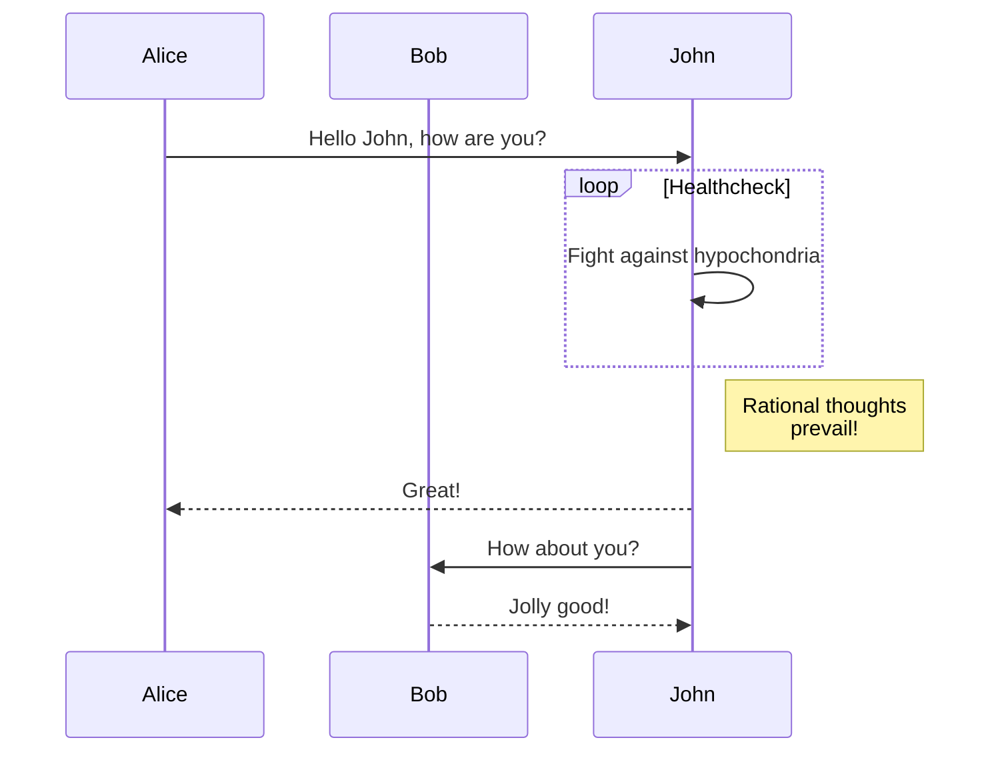
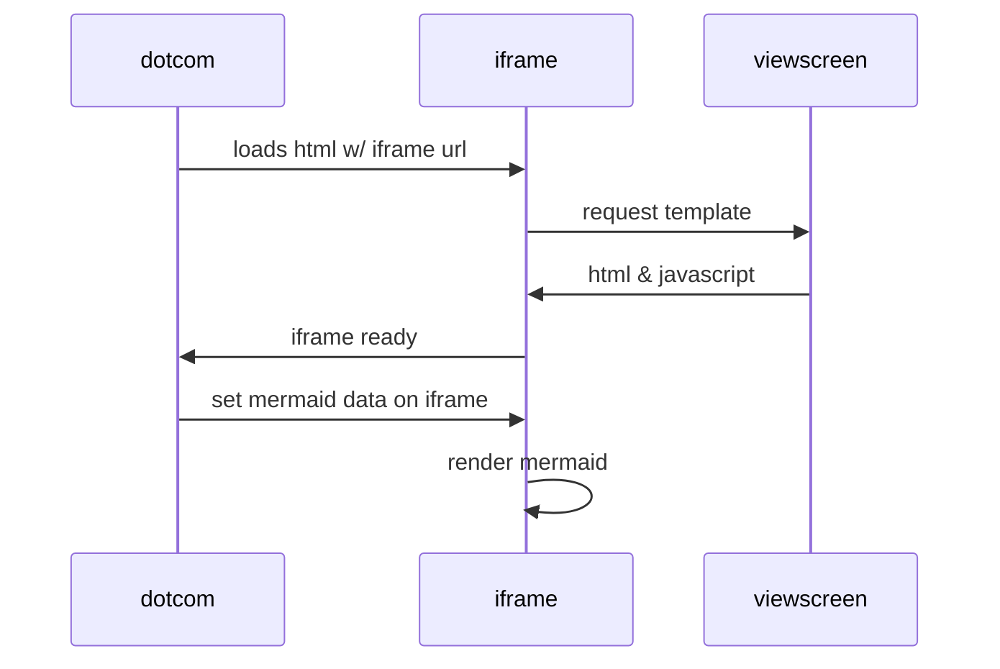

## Flask / REST practice

CircleCI Badge [](https://circleci.com/gh/sosi-org/REST-practice)

This is a very old project from 2018. Some practices are deprecated now.

## How to
### Setup-I

React <-- WebSocket

STEPS: [1]
#### Step 1
```bash
bash ./scripts/run_setup.bash
```
Then:
```bash
source ./temp/p3-for-me/bin/activate
# python ./app.py &
python ./app.py 1>/dev/ttys000 2>/dev/ttys000 &
```
#### Step 2
Then:
```bash
cd webapp
npm i
mkdir -p public
npm run build  # in webapp/build
npm run watch 1>/dev/ttys000 2>/dev/ttys000 &
```
(tested on node v16.15.0)
See [2]

#### Step 3
Then:
```
python wsock_ejector/wsock_ejector.py
```

#### Step 4
Then:
* Navigate to `file://`....`/REST-practice/webapp/webapp.html` using `open webapp/webapp.html`
or
```bash
python -m SimpleHTTPServer 8080`
open http://127.0.0.1:8000/webapp.html
```

#### Setup 1:
Processes:
1. `python ./app.py`
2. ` `
3. `bash curl_tests.sh`
4. `python wsock_ejector/wsock_ejector.py`

```
wsock_ejector ---ws--->  react app (browser)
```
<!-- see https://github.com/sohale/point-process-simple-example/blob/master/caption.md -->
<!--- failed: -->
[State]λ -.-^[Spikes {bg:orange}]" />
<!--  https://medium.com/tenxor/how-to-generate-a-sequence-diagram-within-markdown-using-js-sequence-diagram-and-mkdocs-91dd4fe0b8fb -->
<!-- https://github.blog/2022-02-14-include-diagrams-markdown-files-mermaid/ -->



## References:
[1]  https://blog.miguelgrinberg.com/post/designing-a-restful-api-with-python-and-flask
[2] [krasimir/react-bare-minimum](https://github.com/krasimir/react-bare-minimum) and related [post](https://krasimirtsonev.com/blog/article/The-bare-minimum-to-work-with-React) ...


## Featured
* REST
* Flask
* Continuous Integration: circleCI (github)

## Featured (porovisional)
* async [TODO]
* Continuous Integration: circleCI (local) [TODO]
* WebSockets [TODO]
* WSGI

### Some day:
* Secure WebSockets [TODO]

## Terms
### Concepts
* WebSocket Infolets
* Droplet
* channel
* drip
* EventBasket

### Domain/Instance (business logic)
* Invoice: WebSocket Infolets
* `channel-h`: Channel ( username or vicinity whom we are subscribed to. Channel in the sense of Kafka. Filter.)
   *   Boradcast to vicinity?
* `ra-content`: The board up price updates ("Recent invoices for" channel)
* drip: `{username, amount, timestamps}`
* `state.drips`
* `state`
* "EventMonitorApp" has properties: `channel` and `drips`

* TimestampList1
* tslist

* `EventBasket` (React component)
* timesampsstack

* `React.Component`s:
   * EventBasket
   * TimestampList1
   * EventMonitorApp

* `React.Component`s:
   * `EventBasket`
        * properties: `timesampsstack`
        * state: -
   * `TimestampList1`
        * properties: `tslist`
        * state
   * `EventMonitorApp`
        * properties: `channel`
        * state:


### Processes:
   * App
   * WebApp (and its server)
   * test (curl)
   * test (python)

## Learning
* See [my old react notes](https://github.com/sohale/cs-glossaries/blob/master/js/react.md)
* See this [sosi-org/REST-practice](https://github.com/sosi-org/REST-practice)
* See [Story in Audiotour at StrikingThirteen](https://github.com/StrikingThirteen/Audiotour-Sandbox/blob/master/spa/hello-world/src/Story.js)

### Property versus state:
* **Property** is set from outside (eg by (DOM) parent). It is given to the component. Set "for" the component (from outside). It can be a javascript object. Is const per instance of component. (Hence, if props is changed also conesquently, `render()` is called again. is Slow. You can have a function (lambda) as a property. also onClick, onInvalide, etc. (Similar to html attributes.)

* **State** is variable (time-varying). is fast. Render is called when state is changed.

Can bubble up.

|  property               |       state     |
|:------------------------|----------------:|
| is slow                 | is fast         |
| is hard                 | is soft         |
| set from outside        | set from inside |
| can be function         | -               |
| effect during instantiation             | triggers `render()`     |
| changable only at constructor time      | changable               |
| component doesn't have control over it  | has control over it     |
| one way change                          | changed from inside too |
| similar to process' envs                | program state           |
| similar to function args                | similar to function local variables |


## Change log:
* Version 1: As it was on 25 sept 2018 before LBG - [branch: pre-lbg-as-of-25-sep-2018](https://github.com/sosi-org/REST-practice/tree/pre-lbg-as-of-25-sep-2018)
